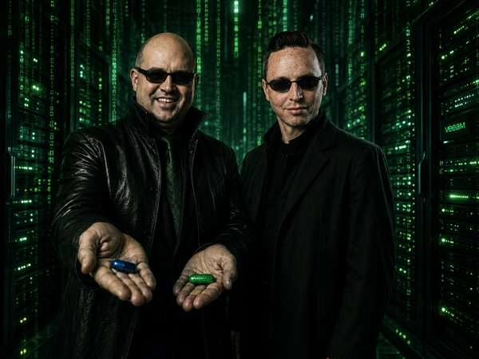

# VeeaMatrix — The Veeam-Themed Matrix Screensaver

A fully-functional Windows screensaver (`.scr`) where the Matrix digital rain spells out Veeam product names, features, and buzzwords. `IMMUTABILITY`, `ZERO-TRUST RESILIENCE`, `VBR V13`, `VEEAM DATA CLOUD VAULT` — 70+ terms cascading down your screen in glowing green (or violet, or teal, or crawl-yellow…).



## Download

👉 **[Latest Release → VeeaMatrix.scr](../../releases/latest)**

Single `.scr` file — no installer, no dependencies. .NET Framework 4.x ships with every Windows 10/11 system.

---

## Installation

1. **Download** `VeeaMatrix.scr`
2. **Right-click** the file:
   - **Install** — registers as system screensaver (requires admin)
   - **Test** — runs fullscreen immediately
   - **Configure** — opens the settings dialog

   Or double-click to run it directly.

> **⚠️ Windows SmartScreen warning?**
> Because this file is not commercially code-signed, Windows Defender SmartScreen may block it on first run.
> **Fix:** Right-click `VeeaMatrix.scr` → **Properties** → tick **Unblock** at the bottom → **OK** — then run normally.
> Alternatively click **"Weitere Informationen"** (More info) in the SmartScreen dialog → **"Trotzdem ausführen"** (Run anyway).

---

## Features

| Feature | Details |
|---|---|
| **Matrix rain** | GDI+ double-buffered, per-column speed variation, glyph scramble |
| **`* MATRIX RAIN *`** | 7 word effects: Scroll, Fade, Build, Scramble, Scan, Zoom, Glitch |
| **`* STAR WARS INTRO *`** | Star Wars–style perspective scroll with static intro phase |
| **Dual banner** | Matrix-style banner in Word Stream mode, Jedi banner in CRAWL mode — both hard-embedded |
| **Color profiles** | 7 built-ins: Veeam, Cyberpunk, Amber CRT, Deep Space, Aurora, Star Wars, Hello Kitty |
| **Color picker** | 2 consolidated buttons — Color + Head (bright) — apply to all layers at once |
| **No RAIN** | Suppress background rain during word effects or CRAWL |
| **Watermark** | Logo + subtitle, bottom-right, optional |
| **Settings UI** | Three-column, 1556 px wide, live preview, Light/Dark mode toggle |
| **Banner image** | Two banners hard-embedded as Base64 — switches automatically with mode |
| **Credits button** | Clickable tribute with LinkedIn + blog links |
| **Multi-monitor** | One render surface per screen; primary drives the app lifecycle |
| **Font control** | System font picker, size, Bold, Italic — shared across all word effects |
| **Custom terms** | Edit the built-in catalog per session or save to `%APPDATA%\VeeaMatrix\` |
| **CRAWL templates** | Episode IV, Spaceballs, Veeam Edition — fully editable |
| **Zero install** | Single `.scr` file; right-click → Install, or copy to `System32` |

---

## Color Profiles

Seven built-in profiles — pick your mood:

| Profile | Rain | Head | Vibe |
|---|---|---|---|
| **Veeam** | Veeam green | White | The original |
| **Cyberpunk** | Electric cyan | Yellow | Blade Runner energy |
| **Amber CRT** | Warm amber | Pale yellow | Old-school terminal |
| **Deep Space** | Vivid violet | Pale lavender | Galaxy brain, literally |
| **Aurora** | Emerald-teal | Icy blue | Nordic lights |
| **Star Wars** | Crawl yellow | Pale yellow-white | May the Schwartz be with you |
| **Hello Kitty** | Hot pink | Gold | Chaos |

Custom profiles are stored in `%APPDATA%\VeeaMatrix\profiles.ini`.

---

## Word Effects

Seven distinct effects in a single unified selector:

| Effect | Mode | Direction |
|---|---|---|
| **Scroll** | Word Stream | All 4 directions |
| **Fade** | Stream + Popup | — |
| **Build** | Word Stream | Left / Right |
| **Scramble** | Stream + Popup | Left / Right |
| **Scan** | Popup-style | Left / Right |
| **Zoom** | Popup-style | — |
| **Glitch** | Stream + Popup | — |

---

## CRAWL Mode

A fully perspective-projected Star Wars–style text crawl with:

- **Static intro** — first paragraph fades in centered on screen, just like *"A long time ago…"*
- **Perspective scroll** — remaining text with full 3D projection (tilt, focal length, per-line scale + color gradient)
- **Star-field background** — optional starfield behind the crawl text
- **No RAIN** — background rain automatically suppressed when CRAWL is active

Three built-in templates: **Episode IV**, **Spaceballs**, and **Veeam Edition** (*Episode XIII: The Rise of Cyber Resilience*). All fully editable with Save/Load support.

---

## Term Catalog

70+ Veeam-specific terms ship with the screensaver. A selection:

```
VEEAM DATA PLATFORM · VEEAM DATA CLOUD · VEEAM DATA CLOUD VAULT
BACKUP & REPLICATION · VBR · VBR V13 · VEEAM ONE
VEEAM RECOVERY ORCHESTRATOR · KASTEN BY VEEAM · COVEWARE BY VEEAM
HIGH AVAILABILITY · HARDENED REPOSITORY · IMMUTABLE BACKUPS
AIR-GAPPED REPOSITORY · ZERO TRUST · CYBER VAULT
RANSOMWARE RECOVERY · MALWARE DETECTION · THREAT HUNTING
RECON SCANNER · AGENT COMMANDER · SECURITI AI
DSPM, DSP & AI TRISM · VEEAM'S DATA COMMAND GRAPH
VDP PREMIUM · VDP ADVANCED · VDP ESSENTIALS
3-2-1-1-0 RULE · RPO · RTO · SLA · ALWAYS-ON DATA
```

Customize via **Adjust catalog with built-in terms** in the MISCELLANEOUS section — edit inline per session, or save permanently to `%APPDATA%\VeeaMatrix\terms.txt`.

---

## Build from Source

Requires Windows 10/11 (`.NET Framework 4.x` is pre-installed).

```powershell
.\Build-VeeaMatrix.ps1
```

Compiles `VeeaMatrix.cs` with the built-in `csc.exe` — no Visual Studio, no SDK. Output: `VeeaMatrix.scr`.

To embed a custom banner image, place `VeeaMatrix-banner.jpg` next to the script before building. The banner is also hardcoded as a Base64 fallback in the source, so the distributed `.scr` always shows it.

---

## Multi-Monitor

Runs on **all connected monitors simultaneously**. The primary monitor drives the app lifecycle.

---

## Changelog

| Version | Highlights |
|---|---|
| **v1.84** | Credits: DE "Hommage" text; Blog/GitHub prefixes; blank line; links only on URLs |
| **v1.83** | Save As fully syncs all UI fields; Config Backup button hints about Save As |
| **v1.82** | Settings Profiles merged into BACKUP OPERATIONS; full button labels; UI 5% shorter |
| **v1.81** | BACKUP OPERATIONS: Settings Profiles — save/load full settings as named `.ini` files |
| **v1.80** | Narrower cinema bars (86%); Credits white text; Crawl button grey/white |
| **v1.79** | Cinema letterbox — both banners fill-width, 72% height, equal bars top+bottom |
| **v1.78** | Credits Light mode fix; full-width Matrix banner, bars on top; Term Catalog dark/light |
| **v1.77** | Credits OK button; Term Catalog smaller + dark/light mode |
| **v1.76** | Credits button (LinkedIn + blog links); dual-banner black bars |
| **v1.75** | `* MATRIX RAIN *` / `* STAR WARS INTRO *` button labels; tribute in Credits popup |
| **v1.74** | Fix column alignment (div2/div3); DE/EN button labels |
| **v1.73** | Recompress Jedi banner (87 KB) — `.scr` shrinks from 1.9 MB to 758 KB |
| **v1.72** | Narrower left column (420 px), fill-width banner rendering |
| **v1.71** | Dual banner — Jedi image in CRAWL mode, Matrix image in Word Stream mode |
| **v1.70c** | Fix DE UI overlaps in MISCELLANEOUS section |
| **v1.70b** | Word Stream defaults restored on Crawl exit; `TrkSet` handles max reduction |
| **v1.70** | Major UX overhaul — Star Wars CRAWL intro phase, consolidated UI, bug fixes |
| **v1.61** | PopupHideRain + layout/UX polish |
| **v1.60** | Section headers grey when inactive; Custom Terms fixes; full layout restructure |
| **v1.56** | Word Mode 3-way exclusive selector (CRAWL / WORD STREAM Rain / POPUP WORDS) |
| **v1.50** | **Star Wars** color profile; CRAWL perspective projection; blank-line paragraph spacing |
| **v1.36** | Color picker consolidated to 2 buttons (Color + Head bright) |
| **v1.35** | CRAWL mode — Star Wars–style perspective scroll, Veeam Edition template |
| **v1.28** | New **Aurora** color profile (emerald teal / icy blue) |
| **v1.27** | Banner always visible — hardcoded Base64 fallback; GDI+ stream/GC bug fixed |
| **v1.26** | Content isolation: disabling all Veeam sources produces pure matrix rain |
| **v1.25** | Expanded term catalog (VBR V13, HA, VDP tiers, RECON SCANNER, AI TRiSM…); Bold/Italic flags |
| **v1.22** | Light/Dark theme toggle in settings; banner embedded in `.scr` via build script |
| **v1.19** | Three-column settings UI with live preview (640×360, 16:9) |
| **v1.16** | Multi-monitor support; five popup animation modes |

---

## License

MIT — free to use, modify, and distribute.

---

*Built entirely through an AI-assisted development process (Claude by Anthropic) — no IDE, no StackOverflow, just a chat window and `csc.exe`.*
